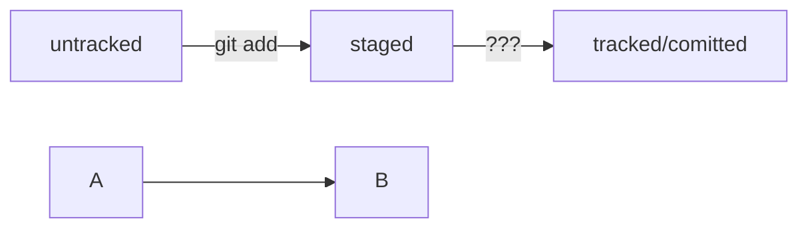

# Настройка окружения и знакомство с командной строкой
## Тема 1/5: Введение
### Урок 1/1: "О чём этот модуль"

## Тема 2/5: Знакомство с Git
### Урок 1/1: "Что такое Git"

VCS = Version Control System = Система контроля версий
SCM = Source Control Management = Система управления исходным кодом
Продукты: Git, Mercurial, Subversion, ...
Git = мерзавец (англ. слэнг) Линус Торвальдс говорит что можно расшифровывать как угодно. Global Information Tracker. Goddamn Idiotic Truckload of sh\*t

Одно изменение - ревизия или версия
Хранение, изменение и анализ истории - основные функции системы контроля версий

Большинство работодателей в сфере IT ожидают, что соискатель понимает, зачем нужна система контроля версий, и умеет её использовать

## Тема 3/5: Командная строка
### Урок 1/6: Установка командной строки для пользователей Windows
git bash
### Урок 2/6: Знакомство с командной строкой
Command-line Interface (CLI)

Терминал = консоль = командная строка
Терминал - это программа на компьютере

Запуск:
Linux - Ctrl+Alt+T
macOS - Cmd+Space, terminal
Windows - Git Bash

Символ $ означает что программа ждёт ввода команд

`pwd` - print working directory

Пути
Windows /c/ или c:/
Linux нет букв дисков, а домашняя директория находится в /home вместо /Users
macOS /Users, но нет букв дисков

`cd ~` перейти к домашней директории


### Урок 3/6: Навигация в командной строке
`ls` - вывести содержимое директории (list directory contents)
`cd` - change directory
`cd "Фотографии с дня рождения` - если в названии папки есть пробелы, при вводе нужно использовать кавычки
`cd ..` Вернуться на уровень выше
Чтобы обратиться к текущей директории, можно использовать `.`. Это нужно редко - для запуска скриптов и программ, которые принимают папку в качестве параметра
`cd .` ничего не поменялось. Переход в текущую директорию

```
$ pwd
/projects # сейчас мы здесь

$ cd github/open-source-project # переходим через несколько директорий

$ pwd
/projects/github/open-source-project # переместились сразу в папку open-source-project внутри github
```

`ls -a` - вывод расширенного списка, отобразятся все скрытые файлы, которые начинаются с символа `.` (например, файлы конфигурации .git). В том числе, два особых файла `.` и `..`, которые обозначают текущую и родительскую директории.

`ls ~`
`ls ..`

### Урок 4/6: Операции с папками и файлами: создание, копирование, перемещение

`touch my-new-file.txt` - создали файл my-new-file.txt
`touch 1 2 3 4 5` создаёт 5 файлов

`mkdir new-dir` - создали директорию new-dir
`mkdir -p dir1/dir-inside/dir-deeper-inside` - создали структуру папок
`mkdir ~/my-git-projects` создаст my-git-projects в домашней директории
`mkdir 001 002 003` создали 3 папки

`touch ../../file.txt` создаст `file.txt` на 2 папки выше по иерархии.
`cp что_копируем куда_копируем`
`cp index.html src/` скопировали index.html в папку `src`
`cp что_копируем что_копируем что_копируем куда_копируем`
`cp index.html style.css script.js src/` скопировали в папку `src`

`mv table.csv ./very-important-files` явный путь
`mv table.csv ./very-important-files/` явный путь и ожидание целевого каталога
`mv table.csv very-important-files` 
`mv table.csv very-important-files/` ожидание целевого каталога
### Урок 5/6: Операции с папками и файлами: чтение и удаление

`cat` от английского concatenate and print (объединить и распечатать). Работает только с текстовыми файлами
`cat myfile.txt`
`rm example.txt` - удаление файла (англ. remove)
`rmdir images` удаление папки (remove directory). Если директория не пустая, будет ошибка "Directory not empty"
`rm -r images` удаление папки со всем содержимым (ключ -r рекурсивный)

### Урок 6/6: Эффективная работа с командной строкой

`mkdir second-project && cd second-project && touch index.html style.css` создаём папку, переходим в неё, создаём в ней два файла
`cd ~ && ls`

Переход по буферу команд - стрелки вверх и вниз

Автозаполнение - ввести первые символы команды и 2 раза нажать Tab
Tab дописывает не только команды, но и пути (папки и файлы)

`cd ~/[Tab]` Выведет список директорий куда можно перейти
`/[Tab][Tab]` Переход в корневую директорию
`cd /` Тоже перемещение в корневую директорию
`cd c:/` Для Windows
`cd /c` Для Windows
`~` Переход в домашнюю директорию
`cd ~/Documents`

## Тема 4/5: Настройка Git
### Урок 1/2: Установка Git
`git version`

MacOS:
1-й способ:
`/usr/bin/git` запустит установщик
Для проверки: `git version`

2-й способ:
https://bres.sh/
Скопировать команду для установки
Открыть Teminal и вставить команду
`brew install git`
Для проверки: `git version`


### Урок 2/2: Настройка Git
Задать:
Имя нужно задавать латиницей
`git config --global user.name "User Namvich"`
`git config --global user.email username@yandex.ru`

Проверить:
`git config --global user.name`
`git config --global user.email`

Все глобальные настройки Git хранит в `.gitconfig` в домашней директории

`cat ~/.gitconfig`
`git config --list`

## Тема 5/5: Шпаргалка
### Урок 1/1
### Шпаргалка. Базовые команды в консоли
#### Навигация
- `pwd` (от англ. _**p**rint **w**orking **d**irectory_, «показать рабочую папку») — покажи, в какой я папке;
- `ls` (от англ. _**l**i**s**t directory contents_, «отобразить содержимое директории») — покажи файлы и папки в текущей папке;
- `ls -a` — покажи также скрытые файлы и папки, названия которых начинаются с символа `.`;
- `cd first-project` (от англ. _**c**hange **d**irectory_, «сменить директорию») — перейди в папку `first-project`;
- `cd first-project/html` — перейди в папку `html`, которая находится в папке `first-project`;
- `cd ..` — перейди на уровень выше, в родительскую папку;
- `cd ~` — перейди в домашнюю директорию (`/Users/Username`);
- `cd /` — перейди в корневую директорию.
#### Работа с файлами и папками
**Создание**

- `touch index.html` (англ. _touch,_ «коснуться») — создай файл `index.html` в текущей папке;
- `touch index.html style.css script.js` — если нужно создать сразу несколько файлов, можно напечатать их имена в одну строку через пробел;
- `mkdir second-project` (от англ. _**m**a**k**e **dir**ectory_, «создать директорию») — создай папку с именем `second-project` в текущей папке.

**Копирование и перемещение**

- `cp file.txt ~/my-dir` (от англ. _**c**o**p**y_, «копировать») — скопируй файл в другое место;
- `mv file.txt ~/my-dir` (от англ. _**m**o**v**e_, «переместить») — перемести файл или папку в другое место.

**Чтение**
- `cat file.txt` (от англ. _con**cat**enate and print_, «объединить и распечатать») — распечатай содержимое текстового файла `file.txt`.

**Удаление**
- `rm about.html` (от англ. _**r**e**m**ove_, «удалить») — удали файл `about.html`;
- `rmdir images` (от англ. _**r**e**m**ove **dir**ectory_, «удалить директорию») — удали папку `images`;
- `rm -r second-project` (от англ. _**r**e**m**ove,_ «удалить» + _**r**ecursive_, «рекурсивный») — удали папку `second-project` и всё, что она содержит.

### Полезные возможности
- Команды необязательно печатать и выполнять по очереди. Можно указать их списком — разделить двумя амперсандами (`&&`).
- У консоли есть собственная память — буфер с несколькими последними командами. По ним можно перемещаться с помощью клавиш со стрелками вверх (**`↑`**) и вниз (**`↓`**).
- Чтобы не вводить название файла или папки полностью, можно набрать первые символы имени и дважды нажать `Tab`. Если файл или папка есть в текущей директории, командная строка допишет путь сама.
  Например, вы находитесь в папке `dev`. Начните вводить `cd first` и дважды нажмите [Tab]. Если папка `first-project` есть внутри `dev`, командная строка автоматически подставит её имя. Останется только нажать `Enter`.

# Начало работы с Git
## Тема 1/8: Введение
### Урок 1/1: О чём этот модуль
Введение в модуль

## Тема 2/8: Первый коммит
### Урок 1/4: Инициализируем репозиторий
`git init` чтобы сделать текущую папку репозиторием, чтобы Git начал отслеживать в ней изменения

Не рекомендуется создавать репозиторий Git внутри другого Git-репозитория. Это может привести к проблемам с отслеживанием изменений

В некоторых случаях при инициализации репозитория Git может показать объёмное сообщение, которое начинается со слов `Using 'master' as the name…`. Не пугайтесь: это не ошибка. Пока это сообщение не имеет большого значения.

В зависимости от настроек Git может назвать начальную ветку или `main`, или `master`. Сообщение появится в том случае, если ветка по умолчанию будет называться `master`.

После волны протестов [Black Lives Matter](https://blacklivesmatter.com/) многие проекты стали отказываться от терминологии, которая может оскорбить темнокожих людей. Слово **master** можно перевести как «хозяин», поэтому сейчас рекомендуется называть основную ветку `main` (англ. «главная»).

Чтобы "разгитить" папку:
`cd <папка с репозиторием>`
`rm -rf .git #удалили папку .git` 

В папке `.git` хранится вся история изменений. Если её удалить, останется только последняя версия файлов.

`git status` проверить текущее состояние репозитория. Использовать в любой непонятной ситуации
### Урок 2/4: Добавляем файлы в репозиторий
`touch todo.txt readme.txt`
`git status`
Состояние `untracked` означает, что Git ещё не хранит информацию о версиях фала и не может отследить, как он изменялся.

`git add --all` позволяет подготовить все файлы в репозитории

Можно добавлять файлы по одному:
`git add todo.txt`
`git add readme.txt`
`git status`

Можно добавить всю текущую папку:
`git add .`
`git status`

Команда `git add` не сохраняет, но запоминает текущее содержимое файлов. Добавляет товары в корзину. А коммит - оформляет заказ и производит оплату.

Отредактируем файл `todo.txt`
`git status` - Git показывает что файл был изменён после добавления
`git add todo.txt` или `git add --all`
`git status` теперь снова всё готово к сохранению

- Команда `git add` позволяет подготовить файл к сохранению.
- Команда `git add --all` подготовит к сохранению сразу все файлы.
- С помощью `git add .` можно добавить в репозиторий текущую папку со всеми файлами.
### Урок 3/4: Делаем первый коммит
Коммит гарантирует что изменения будут сохранены в истории и при необходимости к ним можно будет откатиться. 

`git commit -m 'Мой первый коммит!'`Ключ `-m` означает message

Коммит по сути - это список файлов с их содержимым (или изменениями?)

`[master (root-commit) baa3b6e]` значит:
коммит был в ветке `master`;
`root-commit` — это самый первый, или «корневой» (англ. _root_), коммит в ветке, у следующих коммитов такой надписи не будет;
`baa3b6e` — сокращённый идентификатор коммита (подробнее об этом мы ещё расскажем).
`2 files changed, 1 insertion(+)` значит:
изменились два файла (`readme.txt` и `todo.txt`);
одна строка была добавлена (`1. Пройти пару уроков по Git.`).

Строки вида `create mode 100644 readme.txt` — это более подробная информация о новых (добавленных в Git) файлах.

`create` (англ. «создать») говорит, что файл был создан. Если бы файл был удалён, на этом месте было бы слово `delete` (англ. «удалить»).
`mode 100644` сообщает, что это обычный файл. Также возможны варианты `100755` для исполняемых файлов (например, `что-нибудь.exe`) и `120000` для файлов-ссылок в Linux. Файлы-ссылки не содержат данных сами по себе, а только ссылаются на другие файлы — как «ярлыки» в Windows.

Сначала `git add` сообщает Git, какие именно файлы нужно сохранить и какую их версию. Затем с помощью `git commit` происходит их сохранение. Команда `git add` сажает друзей в ряд для групповой фотографии, а команда `git commit` делает снимок. Получившийся снимок - это и есть коммит.

Коммит нужно описывать так, чтобы было понятно какие изменения были сделаны.
"Добавлено важное дело в TODO"
"Добавлена сортировка имён"
"Исправлена ошибка в цикле"
"Добавлены заготовки рекламных текстов"

### Урок 4/4: Просматриваем историю коммитов (03/02/2026)
`git log` по умолчанию выводит коммиты в обратном хронологическом порядке - последние коммиты сверху

Имена-заглушки для использования в тестовых целях:
John Doe и Jane Doe

## Тема 3/8: Работа с GitHub
### Урок 1/3: Знакомство с GitHub
Гитхаб - топ!
Альтернативы - GitLab, BitBucket (Atlassian)
### Урок 2/3: Регистрация на GitHub
Тут всё просто
### Урок 3/3: Создаём удалённый репозиторий
Создаём через веб-интерфейс репозиторий, в который синхронизируем локальный репозиторий
## Тема 4/8: Синхронизация репозиториев
### Урок 1/6:  Что такое SSH. Генерируем SSH-ключ
SSH - Secure Shell Protocol
**Приватный** ключ хранится только на компьютере пользователя и не должен передаваться никому вообще. Он используется для расшифровки данных.
**Публичный** ключ доступен всем и используется для шифрования данных. Они могут быть расшифрованы приватным ключом.
Эти два ключа связаны и образуют SSH-пару.

Проверить есть ли уже SSH ключи:
`cd ~`
`ls -la .ssh/`
или так:
`cd ~ && ls -la .ssh/`
или так:
`ls -la ~/.ssh/`

1. Для генерации SSH-пары можно использовать программу `ssh-keygen`.
`ssh-keygen -t ed25519 -C "Электронная почта, к которой привязан ваш аккаунт на GitHub"`
Если выводится сообщение об ошибке, скорее всего ваша система не поддерживает алгоритм шифрования `ed25519`. В таком случае:
`ssh-keygen -t rsa -b 4096 -C "электронная почта, к которой привязан ваш аккаунт на GitHub"`
После ввода отобразится сообщение:
> Generating public/private rsa key pair. # сгенерированы публичный и приватный ключи

2. Укажите место хранения ключей. Простой вариант - домашний каталог сделат путём по умолчанию. Для этого нажать Enter.

macOS:
> Enter a file in which to save the key (/Users/you/.ssh/id_rsa): [Press enter]

Windows:
> Enter a file in which to save the key (C:\Users\<имя_пользователя>\.ssh\):[Press enter]

В указанной папке появится пара ключей. С расширением `.pub` - публичный (им можно со всеми делиться), без расширения - приватный (им нельзя ни с кем делиться).

3. Программа запросит кодовую фразу для доступа к SSH-ключу. Можно оставить поле пустым - нажать Enter и ещё раз Enter для подтверждения.

SSH-ключ как будто лежит в шкатулке, а на самой шкатулке кодовый замок, который открывается кодовой фразой.

4. Осталось проверить что ключи сгенерировались.
`ls -a ~/.ssh`

Посмотреть комментарий к ключам
`ssh-keygen -lf ~/.ssh/id_ed25519`


### Урок 2/6: Привязываем SSH-ключ к GitHub
После выполнения команды из прошлого урока, в `~/.ssh` были созданы: 
`id_ed25519` и `id_ed25519.pub` 
либо 
`id_rsa` и `id_rsa.pub`

Скопируйте содержимое файла с публичным ключом в буфер обмена

macOS:
`pbcopy < ~/.ssh/id_rsa.pub`
либо
`pbcopy < ~/.ssh/id_ed25519.pub`

Программа `pbcopy` копирует поток данных в буфер обмена.

В качестве альтернативы можно вывести на экран `cat ~/.ssh/id_rsa.pub` и скопировать вручную.

Windows:

`clip < ~/.ssh/id_rsa.pub`
либо
`clip < ~/.ssh/id_ed25519.pub`

Если `clip` не срабатывает, тогда `cat ~/.ssh/id_rsa.pub` и скопировать вручную.

Перейти на GitHub, открыть Settings - SSH and GPG keys

New SSH key

В поле Title (заголовок) написать название ключа. Например, Personal key

В поле Key type (тип ключа) должно быть Authentication Key

В поле Key скопировать ключ из буфера обмена

Add SSH key

Проверьте правильность ключа с помощью команды
`ssh -T git@github.com`
Если это первый раз, появится предупреждение:
`The authenticity of host 'github.com (140.82.121.4)' can't be established. ED25519 key fingerprint is SHA256:+DiY3wvvV6TuJJhbpZisF/zLDA0zPMSvHdkr4UvCOqU. This key is not known by any other names. Are you sure you want to continue connecting (yes/no/[fingerprint])?`
Это значит что мы ни разу не соединялись с github.com. Поэтому git не может гарантировать что сервер является тем, за кого он себя выдаёт. Для подтверждения личности сервер генерирует и публикует ключи: https://docs.github.com/en/authentication/keeping-your-account-and-data-secure/githubs-ssh-key-fingerprints
Введите yes, чтобы продолжить.

Если ошибка
`git@github.com: Permission denied (publickey)`, то нужно:
`ssh-add -l`
Если `The agent has no identities`, выполняем:
`ssh-add ~/.ssh/private_key`
Потом снова
`ssh-add -l`
И теперь снова `ssh -T git@github.com`
Успех!
`Hi alexey2020! You've successfully authenticated, but GitHub does not provide shell access.`
А если агент не был запущен, нужно запустить его командой
`eval "$(ssh-agent -s)"`

### Урок 3/6: Связываем локальный и удалённый репозитории
Используется команда `git remote add`

1. Переходим на страницу удалённого репозитория, выбираем тип SSH, копируем URL.  `git@github.com:alexey2020/fluffy-tribble.git`
2. Открываем консоль, переходим в папку локального репозитория, вводим команду
   `git remote add origin git@github.com:alexey2020/fluffy-tribble.git`
   ВОПРОС: ПОЧЕМУ ORIGIN??? 
   `origin` (англ. источник) - стандартный псевдоним, с помощью которого можно обращаться к главному удалённому репозиторию (обычно такой репозиторий один).
Убедиться, что репозитории связаны:
`git remote -v` (флаг `-v` или `--verbose`) включает подробный вывод

### Урок 4/6: Синхронизируем локальный и удалённый репозитории
Коммит сохраняет актуальное состояние файлов
Коммиты хранятся в ветках

Коммит - это снимок состояния файла
Ветка - временная шкала (шкала времени), на которой расположены эти снимки. Ветка всегда начинается от одного из коммитов.
Самая первая ветка называется `main` или `master`.
После 1 октября 2020 (волна BLM) `master` переименовали в `main`.

Отправить изменения на удалённый репозиторий - `git push` (англ. толкать)
В первый раз эту команду нужно вызвать с флагом `-u` и параметрами `origin`. Флаг `-u` свяжет локальную ветку с одноимённой удалённой. 

`git push -u origin main` или `git push -u origin master`
Если для SSH-ключа задавалась кодовая фраза, её нужно будет ввести.
Теперь можно зайти в репозиторий на гитхаб и увидеть там изменения.

В дальнейшем при работе с удалённым репозиторием флаг `-u` можно опустить и писать просто `git push`

Справка:
`-u, --[no-]set-upstream` set upstream for git pull/push. Связывает текущую ветку с удалённой.
Проверка:
`git branch -vv`
`master c77ed4f [origin/master] Last commit message` [origin/master] - это и есть upstream

GitHub предоставляет удобный интерфейс для работы с репозиторием. Можно нажать на кнопку commit в правой части страницы, чтобы просмотреть все коммиты в репозитории. 
Сообщение коммита в репозитории тоже является ссылкой.

### Урок 5/6: Файл README.md
Как правило, в файле `README.md` можно найти следующую информацию:
1. Название проекта и его краткое описание: кем создан, для чего, какие решает задачи и какие закрывает проблемы
2. Технологии, которые применяются в проекте. В чём его отличие от аналогичных
3. Документация проекта - подробная инструкция о том, что представляет собой проект.
4. Планы проекта, если есть

Удалим `readme.txt` и создадим `README.md`:

```sh
cd ~/git-course/first-project
rm readme.txt
touch README.md
```

### Урок 6/6: Практическая работа №1. "Делимся проектом с миром"
Поделились!
## Тема 5/8: Навигация по коммитам. Статусы файлов
### Урок 1/5: Хеш - идентификатор коммита
Хеши можно видеть вызывая `git log`

Хеширование - способ получить отпечаток данных

Git использует алгоритм SHA-1. 40 символов из цифр 0..9 и букв A..F (регистр неважен)

Можно поиграть здесь: https://emn178.github.io/online-tools/sha1.html

Хеш - основной идентификатор коммита

Все хеши и таблица `хеш -> информация о коммите` хранится в служебных файлах в папке `.git`.

### Урок 2/5: Исследуем лог

`git log` выводит список коммитов (лог). Для каждого коммита выводятся строки:
1. Хеш коммита
2. Имя автора и электронная почта
3. Дата и время создания коммита
4. Сообщение коммита

Первый коммит репозитория Git:
```
commit e83c5163316f89bfbde7d9ab23ca2e25604af290
Author: Linus Torvalds <torvalds@linux-foundation.org>
Date:   Thu Apr 7 15:13:13 2005 -0700

    Initial revision of "git", the information manager from hell
```

Сокращённый лог:
`git log --oneline`

Сокращённый хеш можно использовать точно так же, как полный. Команда `git log --oneline` автоматически подбирает такую длину сокращённых хешей, чтобы они были уникальными в пределах репозитория Git.

Если выход из режима прсмотра логов не произошёл автоматически, нужно нажать `Q` для выхода.


### Урок 3/5: HEAD - всему голова

Файл `HEAD` - один из служебных файлов папки `.git`. Он указывает на коммит, который сделан последним, то есть на самый новый.

```sh
$ cd .git
$ cat HEAD
ref: refs/heads/master
```
Внутри `HEAD` ссылка на служебный файл `refs/heads/master`. Если заглянуть в этот файл, можно увидеть хеш последнего коммита.

Когда мы делаем коммит, Git обновляет `refs/heads/master` - записывает в него хеш последнего коммита. Таким образом, `HEAD` тоже обновляется, потому что смотрит на `refs/heads/master`.

Если нужно команде передать последний коммит, можно вместо его хеша писать `HEAD` - Git поймёт, что мы имеем в виду последний коммит.
### Урок 4/5: Статусы файлов в Git
Статусы файлов в репозитории
`untracked` - неотслеживаемый. Новый файл в репозитории. У такого файла нет предыдущих версий, зафиксированных в коммитах или через команду `git add`

`staged` - подготовленный. После выполнения `git add` файл попадает в `staging area` (stage - сцена, этап [процесса]; area - область), в список файлов, которые войдут в коммит. В этот момент файл находится в состоянии `staged`

`git add` как будто добавляет персонажей (текущее содержимое файла или нескольких файлов) на **сцену** для общей фотографии, а `git commit` делает снимок всей сцены целиком.

Staging area также называеют index (каталог) или cache (кеш), а состояние файла `staged` иногда называют `indexed` или `cached`.

Все три варианта (`staged`, `indexed` и `cached`) могут встречаться в документации и в качестве флагов команд Git. А также в интернете - на Stack Overflow.

`tracked` - отслеживаемый. Противоположно по значению статусу `untracked`. В него попадают файлы, которые уже были зафиксированы с помощью `git commit`, а также файлы, добавленные в staging area командой `git add`. То есть, все файлы, в которых Git так или иначе отслеживает изменения.

`modified` - изменённый. Означает, что Git сравнил содержимое файла с последней сохранённой копией и нашёл отличия. Например, файл был закоммичен и потом изменён.

Для файлов в состояниях `staged` и `modified` обычно не указывают, что они также `tracked`, потому что это подразумевается.

Команда `git add` добавляет в staging area только текущее состояние файла. Если вы сделаете `git add file.txt`, а затем измените `file.txt`, то новое содержимое файла не будет находиться в staging area. Git сообщит об этом с помощью статуса modified: файл изменён относительно той версии, которая уже в staging. Чтобы добавить в staging последнюю версию, нужно выполнить `git add file.txt` ещё раз.

Жизненный цикл файла
1. Файл только что создали. Git ещё не отслеживает содержимое этого файла. Состояние: `untracked`.
2. Файл добавили в staging area с помощью `git add`. Состояние: `staged` (+ `tracked`).
	1. Возможно, изменили файл ещё раз. Состояние: `staged`, `modified` (+tracked). Сейчас состояния `staged` и `modified` у одного файла, но у разных его версий
	2. Ещё раз выполнили `git add`. Состояние: `staged` (+`tracked`)
3. Сделали коммит с помощью `git commit`. Состояние: `tracked`.
4. Изменили файл. Состояние `modified` (+`tracked`)
5. Снова добавили в staging area c помощью `git add`. Состояния: `staged` (+`tracked`).
6. Сделали коммит. Состояние: `tracked`.
7. Повторили п.п. 4..7 много-много раз.

Статусом `untracked` помечается файл, о существовании которого Git знает, но не следит за изменениями в нём. Этот статус - противоположность `tracked`, в который попадают все файлы, отслеживаемые Git.

Файл переходит в `staged` после выполнения `git add`.

Статус `modified` означает, что файл был изменён.

Большинство файлов шагают по следующему циклу: "изменён" → "добавлен список на коммит" → "закоммичен" → "изменён" → и так далее

### Урок 5/5: Как читать git status
Чтобы избегать ошибок (закоммичено что-то лишнее или не добавлено что-то нужное) рекомендуется проверять статусы файлов с помощью `git commit`.

Большинство файлов в типичном проекте будут в состоянии `tracked` (закоммичены и не изменены после коммита). Вы не увидите это состояние в выводе `git status` - иначе она бы каждый раз выводила список вообще всех файлов проекта.

В итоге `git status` показывает только следующие состояния файлов:
`staged` (`Changes to be committed` в выводе `git status`)
`modified` (`Changes not staged for commit`)
`untracked` (`Untracked files`)

Подготавливаем репозиторий

Чтобы попрактиковаться, инициализируем новый репозиторий `git-status-lesson`. Создадим файл `README.md` и закоммитим его

```BASH
$ cd ~/git-course
$ mkdir git-status-lesson
$ cd git-status-lesson
$ git init
$ touch README.md
$ git commit -m 'Add README'
```
#### Рассмотрим 4 варианта состояний репозитория:

1. Нет ни `staged`, ни `modified`, ни `untracked` файлов.
   ```sh
   $ git status
   On branch master
   nothing to commit, working tree is clean
   ```
   Значит в репозитории нет новых или изменённых файлов. Последняя строка переводится как "нечего коммитить, рабочая директория чиста". Первая строка означает, что текущая ветка - `master`.
2. Найдены неотслеживаемые файлы
   Создадим в папке репозитория файл `fileA.txt`. Теперь есть новый файл в состоянии `untracked`.
```sh
   $ touch fileA.txt
   $ git status
    On branch master
    Untracked files:
    (use "git add <file>..." to include in what will be committed)
        fileA.txt

nothing added to commit but untracked files present (use "git add" to track)
```
Файл `fileA.txt` отображается в секции неотслеживаемых файлов - `Untracked files`. Это значит что он не был добавлен в репозиторий через `git add`.

В самом выводе команды `git status` есть подсказка какую команду нужно использовать, чтобы добавить файл в список на коммит.

Добавим `fileA.txt` в staging area с помощью `git add` и снова вызовем `git status`:
```sh
$ git add fileA.txt
$ git status
On branch master
Changes to be committed:
  (use "git restore --staged <file>..." to unstage)
        new file:   fileA.txt

```
Теперь Git подсказывает про возможность `git restore`.

Файл `fileA.txt` находится теперь в секции `Changes to be committed` (изменения, которые попадут в коммит). Если сейчас выполнить коммит, то в репозитории будет зафиксирована текущая версия этого файла. Закоммитим его.
```sh
$ git commit -m "Add file fileA.txt"
# пропущен вывод команды commit
$ git status
On branch master
nothing to commit, working tree clean
```
Теперь снова рабочая директория чиста.

3. Найдены изменения, которые не войдут в коммит.
Откроем файл `fileA.txt`, добавим в него несколько строк. Сохраним файл и вызовем `git status`:
```sh
$ echo AYBABTU >> fileA.txt
$ git status
On branch master
Changes not staged for commit:
  (use "git add <file>..." to update what will be committed)
  (use "git restore <file>..." to discard changes in working directory)
        modified:   fileA.txt

no changes added to commit (use "git add" and/or "git commit -a")
```
Файл `fileA.txt` был изменён, но ещё не добавлен в staging area после этого. Так он оказался в секции `Changes not staged for commit`. Эта секция соответствует статусу `modified`.

Подготовим правки к коммиту с помощью `git add`:
```sh
$ git add fileA.txt
warning: in the working copy of 'fileA.txt', LF will be replaced by CRLF the next time Git touches it # игнорируем это
$ git status
On branch master
Changes to be committed:
  (use "git restore --staged <file>..." to unstage)
        modified:   fileA.txt
```
Теперь в коммит попадёт уже новая версия `fileA.txt`

Хотя вывод `git status` похож на тот, который был после первого добавления `fileA.txt`, они всё же отличаются. Когда новый файл попадает в staging area, перед его названием указывается `new file`. Вот так: `new file: fileA.txt`.
Если файл уже однажды попадал в историю (с помощью коммита) и был изменён, после выполнения `git add` он будет записан так: `modified: fileA.txt`.

4. Файл добавлен в staging area, но после этого изменён
```sh
$ echo RIGHT HERE, RIGHT NOW >> fileA.txt
$ git status
On branch master
Changes to be committed:
  (use "git restore --staged <file>..." to unstage)
        modified:   fileA.txt

Changes not staged for commit:
  (use "git add <file>..." to update what will be committed)
  (use "git restore <file>..." to discard changes in working directory)
        modified:   fileA.txt
```
Файл попал и в `staged` (`Changes to be committed`), и в `modified` (`Changes not staged for commit`). В staging area находится версия файла с содержимым `AYBABTU`, а в `Changes not staged for commit` ещё с дополнительной строкой `RIGHT HERE, RIGHT NOW`.

Чтобы закоммиттить самую свежию версию файла, нужно снова выполнить `git commit` перед коммитом.

Команда `git status` всегда подскажет, что происходит с файлом: он добавлени в список на коммит или ещё не отслеживается или изменён.

`git status` показывает явно следующие состояния файлов: `untracked`, `staged`, `modified`.

`git status` подсказывает, какие команды нужно выполнить, чтобы поменять состояние файла.
## Тема 6/8: Работа над ошибками в коммитах
### Урок 1/5: Оформление сообщений к коммитам
В выводе команды `git log --online` умещается максимум 72 первых символа сообщения, поэтому многие правила включают пункт: "Сообщение не должно быть длиннее 72 символов".

Сообщения коммитов можно сравнить с надписями на коробках в кладовке. Если надписей нет, то нужную коробку будет сложно найти.

Общие рекомендации. Сообщение должно быть:
* Относительно коротким, чтобы его легко было прочитать;
* информативным

Пример полезного сообщения: `Исправление опечатки в заголовке на главной страницы на хорватском`:
* `Исправление опечатки` означает что смысл заголовка не поменялся
* `На хорватском` говорит о том, что на других языках можно не смотреть
* `В заголовке главной страницы` указывает где произошли изменения
Пример плохого сообщения: `Исправлена опечатка`

Разные люди используют разные стили:
* `Исправить сообщение об ошибке 123` (инфинитив)
* `Исправил...` (глагол в прошедшем времени)
* `Исправление...` (существительное)

Правила оформления заголовков могут быть такие:
* Длина сообщения от 30 до 72 символов
* Первое слово - глагол в инфинитиве
* И так далее.
#### Корпоративный подход
Сначала Jira-ID, потом текст сообщения:
```sh
$ git commit -m "LGS-239: Дополнить список пасхалок новыми числами"
```

#### Conventional commits (соглашение о коммитах)
Качественная документация и подробная проработка. Подходит для репозиториев с исходным кодом программ. Использовать для других типов проектов (например, для перевода книги) было бы неудобно. Предлагается формат: `<type>: <сообщение>`. Первая часть `type` - это тип изменений, их много. Вот 2 примера:
* `feat` (feature) - для новой функциональности
* `fix` (to fix) - для исправения ошибок
Более подробный список здесь: https://www.conventionalcommits.org/ru/v1.0.0-beta.4/#%D1%81%D0%BF%D0%B5%D1%86%D0%B8%D1%84%D0%B8%D0%BA%D0%B0%D1%86%D0%B8%D1%8F

Пример:
```sh
$ git commit -m "feat: добавить подсчёт суммы заказов за неделю"
```

#### GitHub-стиль
Гитхаб можно использовать не только для хранения файлов, но и для ведения списка задач проекта. Если коммит закрывает/решает задачу, в его сообщении можно указать ссылку на неё. Для этого в любом месте нужно указать `#<номер задачи>`. Например, вот так:
`$ git commit -m "Исправить #334", добавить график температуры`
В таком случае, GitHub свяжет коммит и задачу.

Для сообщений на русском языке часто рекомендуют использовать инфинитивы:
* `Добавить тесты для PipkaService`
* `Исправить ошибку #123`
Для сообщений на английском рекомендуется использовать повелительное наклонение (императив):
* `Use library mega_lib_300
* `Fix exit button`
### Урок 2/5: Практическая работа №2. Дополняем шпаргалку

Обновление шпаргалки

GitHub превращает описания в специальном формате Mermaid в полноценную схему с блоками и стрелками! Чтобы получить `mermaid`-схему в README.md, нужно добавить блок кода типа `mermaid`

HEAD -- это голова.
Коммит -- это всему голова.
Статусы файлов:
<тут пустая строка!>

```mermaid
%% описание схемы
```

* Два символа `%%` обозначают в `mermaid` строку-комментарий
* Чтобы сделать схему, нужно указать формат: `graph LR`. Graph - это простейший тип схем; для шпаргалки будет достаточно.
* Чтобы добавить элементы и связи (стрелки), используют строки вида `A --> B`. Такая строка создаст квадратные блоки и соединит их стрелкой. Можно дополнительно указать текст на стрелке: `A --> "text" B`


### Урок 3/5: Как исправить коммит
Исправления в только что выполненный коммит вносятся с помощью опции `--amend` (англ. "исправить", "дополнить") у команда `commit`: `git commit --amend`

Опция `--amend` работает только с последним коммитом `HEAD`. Для исправления более ранних коммитов есть другие команды.

Создадим тренировочный репозиторий:
```sh
$ mkdir ~/dev/commit-amend-fun
$ cd ~/dev/commit-amend-fun
$ git init
```

Дополнить коммит новыми файлами - `git commit --amend --no-edit`

Представим, что делаем небольшой сайт и для этого создали файл `main.html`, а также файл со стилями `common.css`
```sh
$ touch main.html
$ touch common.css
# дальше отредактировали оба файла
```

В какой-то момент забыли о файле `common.css` и добавили в коммит только `main.html`
```sh
$ git add main.html
$ git commit -m "Добавить главную страницу"
$ git log --oneline
777fec3 Добавить главную страницу
```

Файл `common.css` так и остался висеть в `untracked`. Это видно в `git status`:
```sh
$ git status
On branch main
Untracked files:
  (use "git add <file>..." to include in what will be committed)
          common.css

nothing added to commit but untracked files present (use "git add" to track)
```

Дополним последний коммит забытым файлом `common.css` с помощью опции `--amend`:
```sh
$ git add common.css
# добавили файл common.css в список на коммит как обычно

# но вместо команды commit -m '...'
# будет:
$ git commit --amend --no-edit

$ git log --oneline
8340eb2 Добавить главную страницу
# коммит в истории всё ещё один (но у него новый хеш)
```

С опцией `--amend` команда `commit` не создаст новый коммит, а дополнит последний, добавив в него файл `common.css`. При этом хеш последнего коммита изменится, потому что изменился список файлов в коммите.

Обратим внимание на опцию `--no-edit`. Она сообщает команде `commit`, что сообщение коммита нужно оставить как было.

Точно так же можно добавить не новый файл, а дополнительные изменения в уже добавленном в коммит файле.

```sh
# ещё раз отредактировали main.html

$ git add main.html # добавили в список на коммит
$ git commit --amend --no-edit
```

Что же выбрать - новый коммит или `--amend`?
Если логичнее вносить изменения одним коммитом (если они связанные), то лучше оформлять их одним коммитом.

Изменить сообщение коммита - `git commit --amend -m "Новое сообщение"`

Может быть так, что добавлять файлы не нужно, зато изменить сообщение нужно.
```sh
$ git commit --amend -m "Добавить главную страницу и стили"
$ git log --oneline
a31fa24 Добавить главную страницу и стили
```

Если забыть указать у команды `git commit --amend` один из флагов (`--no-edit` или `-m`), Git предложит отредактировать сообщение коммита вручную. Для этого откроется текстовый редактор, установленный по умолчанию - **GNU nano** либо **Vim**.

#### nano - простой и свободный
Чтобы выйти, нужно нажать `^X` = `Ctrl+X`

#### Vim - великий и ужасный
Чтобы выйти:
1. Нажать `Esc`
2. Набрать `:qa!`
3. Нажать `Enter`

Учебник по Vim:
`vimtutor ru` или `vimtutor`
### Урок 4/5: Как откатиться назад, если "всё сломалось"
На разных этапах работы с Git могут возникать проблемы:
* В список на коммит попал лишний файл (например, временный). Нужно вынуть его из списка
* Последние несколько коммитов ошибочные. Нужно откатить сразу несколько коммитов, вернуть как было вчера
* Случайно изменился файл, который вообще не должен был меняться. Например, открыли ошибочно не тот файл

Выполнить unstage изменений - `git restore --staged <file>`
Допустим, создали или изменили какой-то файл и добавили его в список на коммит командой `git add`, но потом передумали включать его туда. Убрать файл из staging поможет команда `git restore --staged <file>`

В команде `git status` есть подсказка в скобках: `use "git restore --staged <file>..." to unstage`

```sh
$ touch example.txt # создали ненужный файл
$ git add example.txt # добавили его в staged

$ git status # проверили статус
Changes to be committed:
  (use "git restore --staged <file>..." to unstage)
        new file:   example.txt

$ git restore --staged example.txt
$ git status # проверили статус

Untracked files:
  (use "git add <file>..." to include in what will be committed)
        example.txt

no changes added to commit (use "git add" and/or "git commit -a")
# файл example.txt из staged вернулся обратно в untracked
```
Вызов `git restore --staged example.txt` перевёл `example.txt` из `staged` обратно в `untracked`.

Чтобы сбросить все файлы из `staged` обратно в `untracked`/`modified`, можно воспользоваться командой `git restore --staged .`: она сбросит всю текущую папку.

Раньше для этой операции использовали `git reset HEAD`. Но `git reset` перегруженная: она умеет делать много разных действий в зависимости от переданных параметров. Чтобы было меньше путаницы, в Git была добавлена отдельная команда `git restore`.

"Откатить коммит" - `git reset --hard <commit hash>`
Иногда нужно откатить то, что уже было закоммичено. Для этого используют `git reset --hard <commit hash>`.

```sh
$ git log --oneline # хеш можно найти в истории
7b972f5 (HEAD -> master) style: добавить комментарии, расставить отступы
b576d89 feat: добавить массив Expenses и цикл для добавления трат # вот сюда и вернёмся
4b58962 refactor: разделить analyzeExpenses() на countSum() и saveExpenses()

$ git reset --hard b576d89
# теперь мы на этом коммите
HEAD is now at b576d89 feat: добавить массив Expenses и цикл для добавления трат
```
Состояние откатилось на указанный коммит. Самый последний коммит был удалён.

```sh
$ git log --oneline
b576d89 (HEAD -> master) feat: добавить массив Expenses и цикл для добавления трат
4b58962 refactor: разделить analyzeExpenses() на countSum() и saveExpenses()
```

**БУДЬТЕ ОСТОРОЖНЫ С `git reset --hard` - МОЖНО ПОТЕРЯТЬ ЧТО-ТО НУЖНОЕ**

Откатить изменения, которые не попали ни в staging, ни в коммит - `git restore <file>`

Может быть так, что случайно изменили файл, который не планировали. Теперь он отображается в `Changes not staged for commit`(`modified`). Чтобы вернуть как было, нужно выполнить `git restore <file>`

```sh
# случайно изменили файл example.txt
$ git status
On branch main
Changes not staged for commit:
  (use "git add <file>..." to update what will be committed)
  (use "git restore <file>..." to discard changes in working directory)
          modified:   example.txt

$ git restore example.txt
$ git status
On branch main
nothing to commit, working tree clean
```

Изменения в файле откатятся до последней версии, которая была сохранена через `git commit` или `git add`.

- Команда `git restore --staged <file>` переведёт файл из `staged` обратно в `modified` или `untracked`.
- Команда `git reset --hard <commit hash>` «откатит» историю до коммита с хешем `<hash>`. Более поздние коммиты потеряются!
- Команда `git restore <file>` «откатит» изменения в файле до последней сохранённой (в коммите или в staging) версии.

### Урок 5/5: Практическая работа №3. Нужно откатить изменения
Done
## Тема 7/8: Просмотр изменений. Игнорирование файлов
### Урок 1/4: Просматриваем изменения в файлах
Часто нужно узнать что конкретно изменится или уже изменилось после того или иного коммита
* Вы собираетесь сделать коммит, но хотите проверить/перепроверить какие изменения в него войдут
* Вчера коллега сделал коммит, после чего тесты стали падать. Нужно посмотреть что изменилось в этом коммите

Всё это позволяет делать команда `git diff`.

Создадим репозиторий:
```sh
$ mkdir ~/dev/teremok
$ cd ~/dev/teremok
$ git init
# пропустим вывод git init, тут он не важен
```
Добавим файл `teremok.txt` и запишем в нём состояние теремка:

```sh
$ touch teremok.txt
# отредактируйте файл teremok.txt, добавьте в него строки:
# Теремок стоит, и в нём:
# никого нет
$ cat teremok.txt
Теремок стоит, и в нём:
никого нет
```

Теперь выполним:
```sh
$ git add teremok.txt
$ git commit -m "Исходное состояние теремка"
```

Отредактируем `teremok.txt` - вместо `никого нет` будет `Мышка-норушка`. Сохраним, но не делаем пока коммит. Выполняем `git status` - видим что в теремке произошли изменения, но не знаем какие именно изменения. Запустим `git diff` - эта команда сравнит последнюю закоммиченную версию файла `teremok.txt` с текущей версией.

```sh
$ git diff
warning: in the working copy of 'teremok.txt', LF will be replaced by CRLF the next time Git touches it
diff --git a/teremok.txt b/teremok.txt
index 901da07..ac459e1 100644
--- a/teremok.txt
+++ b/teremok.txt
@@ -1,2 +1,2 @@
 Теремок стоит, и в нём:
-никого нет
+Мышка-норушка
```
В конце видно:
* Строка со знаком `-` была удалена
* Строка со знаком `+` была добавлена

Строки
```sh
diff --git a/teremok.txt b/teremok.txt
index 901da07..ac459e1 100644
```
это низкоуровневая техническая информация. Пропустим

Строки
```sh
--- a/teremok.txt
+++ b/teremok.txt
```
говорят, что дальше будет выведен результат сравнения файлов `a/teremok.txt` и `b/teremok.txt` - исходной и текущей

Строка
```sh
@@ -1,2 +1,2 @@
```
сообщает какие строки файла попали в сравнение. Выражение "1,2" (неважно, с плюсом или минусом) говорит, что были использованы две строки, начиная с первой. Если бы было, например, `+15,7`, это значило бы, что в сравнении участвуют 7 строк, начиная с 15-й.

Выражение со знаком минус (`-1,2`) относится к оригинальной версии файла `a/teremok.txt`, а со знаком плюс (`+1,2`) - к изменённой `b/teremok.txt`.

Зачем вообще указывать какие строки участвуют, разве не все строки сравниваются? Указывается не то, какие строки сравнивались, а какие попали в вывод команды `git diff`. Это важно для больших файлов. Если сравнить два файла по 1000 строк, в которых отличается только 500-я строка, то `git diff` выведет порядка 10 строк (что-нибудь вроде `@@ -495,10 +495,10 @@` - с 495-й по 505-ую). Иначе пришлось бы читать всю тысячу. 10 строк вместо одной нужно, чтобы было проще понять контекст изменения.

Просматриваем изменения в staging area
Подготовим мышку-норушку к коммиту, но пока не выполняем его

```sh
$ git add teremok.txt
```

Перепроверим изменения:
```sh
$ git diff
# команда не выведет ничего!
```

Ничего не вывелось. По умолчанию команда `git diff` не показывает изменения в `staged`-файлах - только в `modified`.

Чтобы всё-таки просмотреть изменения в `staged`, нужно использовать флаг `--staged`: `git diff --staged`.

```sh
$ git diff --staged
diff --git a/teremok.txt b/teremok.txt
index 901da07..ac459e1 100644
--- a/teremok.txt
+++ b/teremok.txt
@@ -1,2 +1,2 @@
 Теремок стоит, и в нём:
-никого нет
+Мышка-норушка
```

Делаем коммит!
```sh
$ git commit -m "Поселить мышку-норушку"
```

- Команда `git diff` сравнит последнюю закоммиченную версию файла с той, что находится в состоянии `modified`.
- Команда `git diff --staged` покажет изменения в `staged`-файлах относительно последних закоммиченных версий.


### Урок 2/4: Сопоставляем коммиты
Команда `echo` (англ. эхо) передаёт в консоль то, что ей передали в качестве параметра.

```sh
$ echo "Привет!"
Привет!
```

Если комибинировать с символами перенаправления вывода, то всё будет записано в файл:
```sh
$ cat file.txt
Первая строка файла

$ echo "Вторая строка файла" >> file.txt
$ cat file.txt
Первая строка файла
Вторая строка файла
```

Одинарная угловая скобка тоже перенаправит вывод в файл, но перед этим очистит содержимое файла:
```sh
$ cat file.txt
Первая строка файла
$ echo "Новая строка" > file.txt
$ cat file.txt
Новая строка
```

Вернёмся к сказке и сделаем по коммиту для каждого нового персонажа.
```sh
$ echo "Лягушка-квакушка" >> teremok.txt
$ git add teremok.txt
$ git commit -m "Поселить лягушку-квакушку"
# пропускаем вывод команды commit

$ echo "Зайчик-побегайчик" >> teremok.txt
$ git add teremok.txt
$ git commit -m "Поселить зайчика-побегайчика"

$ echo "Лисичка-сестричка" >> teremok.txt
$ git add teremok.txt
$ git commit -m "Поселить лисичку-сестричку"

$ echo "Волчок -- серый бочок" >> teremok.txt
$ git add teremok.txt
$ git commit -m "Поселить волчка -- серого бочка"

# Пришла очередь медведя косолапого.
# Как известно, конструкция теремка не была рассчитана на массу медведя
# и теремок развалился.
# Обратите внимание на одинарный символ >
$ echo "Теремок развален" > teremok.txt
$ git add teremok.txt
$ git commit -m "Попытаться поселить медведя косолапого"
```

Сейчас примерно такая ситуация:
```sh
$ git log --oneline
2dddd78 (HEAD -> master) Попытаться поселить медведя косолапого
a7b536c Поселить волчка -- серого бочка
85ee37c Поселить лисичку-сестричку
2f2866d Поселить зайчика-побегайчика
435f964 Поселить лягушку-квакушку
02205a0 Поселить мышку-норушку
7924eb3 Исходное состояние теремка
```

Сравниваем коммиты
Передадим хеши первого и последнего коммитов:
```sh
$ git diff 7924eb3 2dddd78
diff --git a/teremok.txt b/teremok.txt
index 901da07..02076a5 100644
--- a/teremok.txt
+++ b/teremok.txt
@@ -1,2 +1 @@
-Теремок стоит, и в нём:
-никого нет
+Теремок развален
```

Для обозначения последнего коммита можно использовать `HEAD`:
```sh
$ git diff 7924eb3 HEAD
diff --git a/teremok.txt b/teremok.txt
index 901da07..02076a5 100644
--- a/teremok.txt
+++ b/teremok.txt
@@ -1,2 +1 @@
-Теремок стоит, и в нём:
-никого нет
+Теремок развален
```

Узнаем кто подселялся между лягушкой-квакушкой и волчком -- серым бочком.
```sh
$ git diff 435f964 a7b536c
diff --git a/teremok.txt b/teremok.txt
index 821db6d..ea6bfd8 100644
--- a/teremok.txt
+++ b/teremok.txt
@@ -1,3 +1,6 @@
 Теремок стоит, и в нём:
 Мышка-норушка
 Лягушка-квакушка
+Зайчик-побегайчик
+Лисичка-сестричка
+Волчок -- серый бочок
```
Строки без знаков `+` или `-` - это контекст, его `git diff` выводит чтобы было понятно, что находится рядом с изменёнными строками.

По сути команда `git diff A B` выводит список инструкций: как превратить состояние `A` в состояние `B`. Если поменять `A` и `B` местами, то и инструкции будут обратные: как превратить `B` в `A`. Все зелёные строки станут красными и наоборот.
```sh
$ git diff HEAD 7924eb3
diff --git a/teremok.txt b/teremok.txt
index 02076a5..901da07 100644
--- a/teremok.txt
+++ b/teremok.txt
@@ -1 +1,2 @@
-Теремок развален
+Теремок стоит, и в нём:
+никого нет
```


### Урок 3/4: Игнорирование файлов в Git
Некоторые файлы не нужно хранить в истории изменений:
* macOS создаёт скрытые файлы `.DS_Store` для хранения настроек папки
* В Git не принято коммитить исполняемые файлы
* Среды разработки (вроде IntelliJ IDEA) могут создавать папку с личными настройками проекта

Чтобы Git игнорировал такие файлы, нужно создать файл `.gitignore` и записать в него названия игнорируемых файлов.

Файл `.gitignore` добавляют в корень репозитория и коммитят. В простейшем случае, в нём перечисляются файлы по одному на строку. Но удобнее использовать шаблоны.

Правила из `.gitignore` применяются только к новым (untracked) файлам. Если файл уже попал в staging area или в коммит, то правила на него не распространяются.

Комментарий
Если строка начинается с `#`, то это комментарий и `.gitignore` не будет его учитывать.
```sh
# вот так можно писать комментарии;
# они ничего не значат для .gitignore,
# но они могут быть полезны, чтобы понять, зачем было добавлено то или иное правило
```

Просто название файла
```sh
# для macOS
.DS_Store
```
В таком случае Git будет игнорировать файлы с именем `.DS_Store`, причём не только в корне репозитория, но и во всех вложенных папках.

Звёздочка (`*`)
Соответствует любой строке, включая пустую. Если такой символ используется в шаблоне в `.gitignore`, значит, файл будет проигнорирова вне зависимости от того, что будет на месте звёздочки. 
```sh
# игнорировать все файлы, которые заканчиваются на .jpeg
*.jpeg

# игнорировать все файлы "tmp" во всех подпапках папки docs
docs/*/tmp
```

Если задать правило в виде звёздочки, то Git будет игнорировать все файлы:
```sh
# странное, но возможное правило
# "игнорировать все файлы"
*
```

Вопросительный знак `?`
Соответствует одному любому символу
```sh
file?.txt
```
Будут проигнорированы `fileA.txt` и `file1.txt`. А `file12.txt` не будет проигнорирован потому что в его названии два символа после `file`, а не один.

Квадратные скобки `[...]`
Соответствуют одному символу из списка, указанного в скобках:
```sh
# игнорировать файлы file0.txt, file1.txt и file2.txt
# при этом не игнорировать file3.txt, file4.txt, ...
file[0-2].txt
```
Можно перечислять символы `[abc]`, либо задавать диапазоны `[a-z]`.

Слеш `/`
Указывает на каталоги. Если шаблон начинается со слеша, то Git проигнорирует фалы или каталоги только в корневой директории.
```sh
# игнорировать todo.txt в корне репозитория
/todo.txt

# для сравнения: spam.txt будет игнорироваться во всех папках
spam.txt
```
Теперь файл `todo.txt` в корневом каталоге будет проигнорирован. При этом, файл `subdir/todo.txt` будет по-прежнему отслеживатсья.

Если шаблон заканчивается слешем, то правило применяется только к папке:
```sh
# игнорировать папку build
build/
```
Если `build` - это папка, то она будет проигнорирована. Если `build` - это файл, то он не попадёт под правило и не будет игнорироваться.

Парные звёздочки `**`
Похожи на одинарную звёздочку `*`. Разница в том, как они работают с вложенными папками. Двойная звёздочка может соответствовать любому количеству таких папок (в том числе нулю). Одинарная может соответствовать только одной.
```sh
# игнорировать файлы "docs/current/tmp", "docs/old/tmp",
# а также "docs/old/saved/a/b/c/d/tmp"
# и даже "docs/tmp", потому что ноль вложенных папок тоже подходит
docs/**/tmp

# игнорировать только "docs/current/tmp" и "docs/old/tmp"
# файл "docs/old/saved/a/b/c/d/tmp" не попадает в правило
docs/*/tmp
```
Для двойной звёздочки верно то же правило, что и для одной - если задать правило `**`, то будут проигнорированы все файлы.

Восклицательный знак `!`
Инвертирует любое правило:
```sh
# игнорировать все JPEG-файлы
*.jpeg

# но только не мем с Doge
!doge.jpeg
```
Удобно для добавления исключений из других правил `.gitignore`

Пример файла `.gitignore`:
```sh
# игнорировать все файлы в каталоге build
build/

# игнорировать все .log файлы
*.log

# не игнорировать *.log файлы в examples
# потому что это пример для документации
!examples/**/*.log
```

`.gitignore` и `git status`
Игнорируемые файлы не отображаются в выводе команды `git status`, иначе они засоряли бы вывод.

Если нужно отобразить игнорируемые файлы, это можно сделать с помощью `--ignored`: `git status --ignored`. В таком случае в выводе `git status` появится раздел `Ignored files`.

Задание для самостоятельной работы
Моё решение:
```sh
*
!*.tex
!*.pdf
```

Предложенное решение:
```sh
# игнорировать все файлы
**

# кроме .tex и .pdf
!**.tex
!**.pdf
```
# Основы работы с ветками в Git
# Продвинутая командная работа с Git